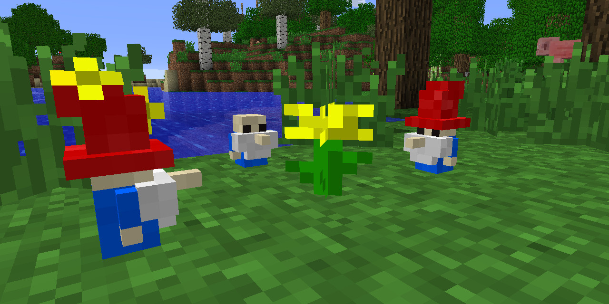

**Minecraft mod for beta 1.7.3 and StationAPI**!

# Gnomed

Gnome your Chums with the new "You've been gnomed" mod. 

**Gnomed** adds Gnomes, stylized on garden gnomes, who laugh, yapp, and can pull gnomish tricks. 

Several different Gnome variants spawn in different environments, some are more rare than others. Collect them all for yourself or hide them in your friends base to gnome them!

Contains **sound effects** from classic video **["You've been gnomed"](https://www.youtube.com/watch?v=6n3pFFPSlW4)**.

## Required dependencies

- **[StationAPI](https://modrinth.com/mod/stationapi)** - version >= **2.0.0-alpha.6.2**

## Compatibility

- **No known compatibility issues**.

## License
#### Copyright (c) 2026 Sayuzaur

The following files are licensed under the **EUPL-1.2-or-later**, unless stated otherwise:

- Java source files under `src/main/java/`
- JSON files under `src/main/resources/`

See [LICENSE](LICENSE) for the full licence text.

Assets, such as textures, sounds, and other non-JSON files under `src/main/resources/assets/`, are **not licensed under the EUPL**.

These assets may not be redistributed, modified, or reused without prior permission.
